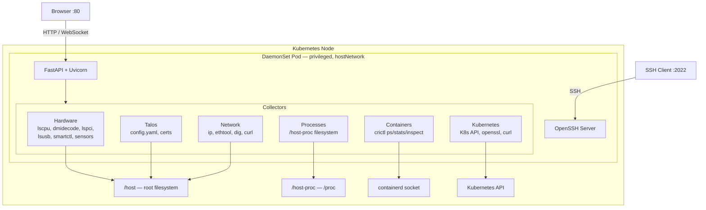
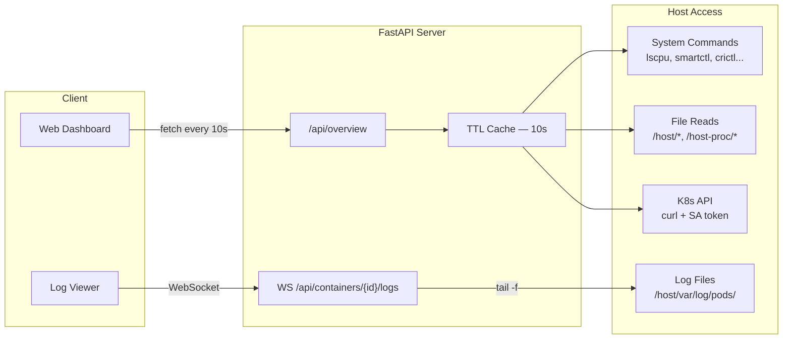
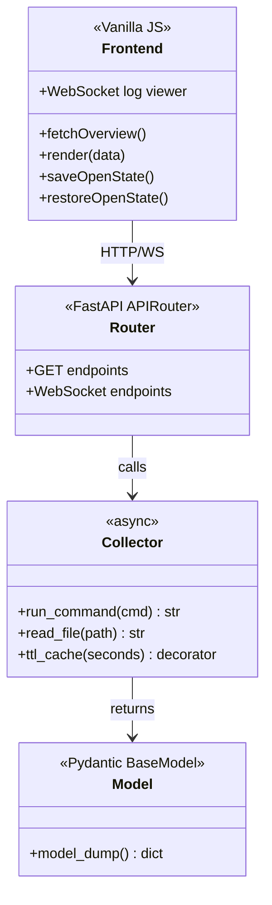

# Node Debug Dashboard

> Hardware monitoring, Kubernetes diagnostics, and container debugging for Kubernetes nodes — accessible as a web dashboard, REST API, and SSH shell.


## Features

- **Hardware** — CPU, RAM (DIMMs, ECC), PCI, USB, NICs, sensors (temps/fans/voltages), NVIDIA GPUs
- **Storage** — Disks, partitions, SMART health, disk usage with severity alerts
- **System** — UEFI boot order and entries
- **Network** — Interface stats, speed/duplex, error counters, DNS/internet/K8s API connectivity
- **Kubernetes** — Node labels, conditions, capacity/allocatable resources, PKI certificates (obfuscated), component health probes
- **Talos** — Machine config (safe fields only), version, certificates
- **Containers** — System services + workload pods with memory stats, separated views
- **Live Logs** — WebSocket-based container log streaming with tail
- **Processes** — Top 200 host processes by memory with PID/PPID/user/CPU%/MEM%
- **Warnings** — Aggregated alerts from SMART, temperatures, memory errors, disk usage, certificate expiry, K8s node conditions
- **Themes** — Dark, Light, and Auto (follows OS preference), persisted in localStorage
- **Auto-refresh** — 10-second polling with persistent UI state (open sections stay open)
- **REST API** — Full Swagger/OpenAPI docs at `/docs`
- **SSH Debug** — Port 2022 with 200+ pre-installed diagnostic tools

## Screenshots

| Dark Theme | Light Theme |
|---|---|
|  |  |

| Hardware (Light) | Log Viewer |
|---|---|
|  |  |


## Architecture

### System Overview



### Data Flow



### Component Model



## Quick Start

### Kubernetes DaemonSet (recommended)

Deploy as a privileged DaemonSet on every node:

```yaml
apiVersion: apps/v1
kind: DaemonSet
metadata:
  name: node-debug-dashboard
spec:
  selector:
    matchLabels:
      app: node-debug-dashboard
  template:
    metadata:
      labels:
        app: node-debug-dashboard
    spec:
      hostNetwork: true
      hostPID: true
      hostIPC: true
      tolerations:
        - operator: Exists
      containers:
        - name: dashboard
          image: registry.iostack.fr/iostack/node-debug-dashboard:latest
          securityContext:
            privileged: true
          ports:
            - containerPort: 80
            - containerPort: 2022
          env:
            - name: KUBERNETES_NODE_NAME
              valueFrom:
                fieldRef:
                  fieldPath: spec.nodeName
          volumeMounts:
            - name: host-root
              mountPath: /host
            - name: host-proc
              mountPath: /host-proc
              readOnly: true
      volumes:
        - name: host-root
          hostPath: { path: /, type: Directory }
        - name: host-proc
          hostPath: { path: /proc, type: Directory }
```

Then access `http://<node-ip>/` for the dashboard, `http://<node-ip>/docs` for Swagger.

### Docker (standalone)

```bash
docker run --privileged --net=host --pid=host \
  -v /:/host:ro -v /proc:/host-proc:ro \
  -p 80:80 -p 2022:2022 \
  registry.iostack.fr/iostack/node-debug-dashboard:latest
```

## API Reference

| Endpoint | Method | Description |
|---|---|---|
| `/api/overview` | GET | All sections aggregated (primary dashboard endpoint) |
| `/api/node` | GET | Hostname, kernel, uptime, load, IPs |
| `/api/hardware` | GET | CPU, memory, PCI, USB, NICs, sensors, GPUs |
| `/api/hardware/cpu` | GET | CPU details |
| `/api/hardware/memory` | GET | RAM + DIMM inventory + ECC |
| `/api/hardware/pci` | GET | PCI devices |
| `/api/hardware/usb` | GET | USB devices |
| `/api/hardware/nics` | GET | Network interfaces |
| `/api/hardware/sensors` | GET | Temperature, fan, voltage readings |
| `/api/hardware/gpus` | GET | NVIDIA GPU info |
| `/api/storage` | GET | Disks, SMART, usage |
| `/api/storage/disks` | GET | Disk list with partitions |
| `/api/storage/smart` | GET | SMART health for all disks |
| `/api/storage/smart/{device}` | GET | SMART for a specific disk |
| `/api/storage/usage` | GET | Disk usage (df) |
| `/api/system/efi` | GET | UEFI boot order |
| `/api/network` | GET | Network interfaces |
| `/api/network/connectivity` | GET | DNS, internet, K8s API checks |
| `/api/kubernetes` | GET | Full K8s overview |
| `/api/kubernetes/node-info` | GET | Node labels, conditions, resources |
| `/api/kubernetes/certificates` | GET | K8s PKI certs (obfuscated) |
| `/api/kubernetes/components` | GET | Component health probes |
| `/api/talos` | GET | Full Talos overview |
| `/api/talos/config` | GET | Machine config (safe fields) |
| `/api/talos/certificates` | GET | Talos certs (obfuscated) |
| `/api/containers` | GET | System + workload containers |
| `/api/containers/system` | GET | Talos system services |
| `/api/containers/workloads` | GET | K8s workload containers |
| `/api/containers/{id}/logs` | WS | Live log stream (WebSocket) |
| `/api/processes` | GET | Top 200 processes by memory |
| `/api/warnings` | GET | Aggregated warnings |
| `/api/health` | GET | Health check for K8s probes |
| `/docs` | GET | Swagger UI |

## Configuration

| Environment Variable | Default | Description |
|---|---|---|
| `HOST_ROOT` | `/host` | Host root filesystem mount path |
| `HOST_PROC` | `/host-proc` | Host /proc mount path |
| `CACHE_TTL` | `10` | Collector cache TTL in seconds |
| `COMMAND_TIMEOUT` | `10` | Subprocess timeout in seconds |
| `KUBERNETES_NODE_NAME` | — | Node name (set via fieldRef in K8s) |

## Development

```bash
# Clone
git clone <repo-url> && cd node-debug-dashboard

# Install dependencies
pip install -r requirements.txt

# Run locally (limited functionality without host mounts)
uvicorn app.main:app --host 0.0.0.0 --port 8080 --reload

# Lint
ruff check app/ && ruff format --check app/

# Build container
docker build -t node-debug-dashboard .
```

## Project Structure

```
app/
├── main.py                 # FastAPI app, router registration
├── config.py               # Environment-based configuration
├── collectors/             # Async data gathering modules
│   ├── base.py             # run_command(), read_file(), ttl_cache()
│   ├── node.py             # Hostname, kernel, uptime, load
│   ├── cpu.py              # CPU model, cores, threads
│   ├── memory.py           # RAM, DIMMs, ECC
│   ├── pci.py              # PCI devices
│   ├── usb.py              # USB devices
│   ├── network.py          # NICs, connectivity
│   ├── sensors.py          # Temps, fans, voltages
│   ├── gpu.py              # NVIDIA GPUs
│   ├── storage.py          # Disks, SMART, usage
│   ├── efi.py              # UEFI boot order
│   ├── dmesg.py            # Kernel log warnings
│   ├── kubernetes.py       # K8s API, certs, components
│   ├── talos.py            # Machine config, certs
│   ├── containers.py       # crictl-based container listing
│   └── processes.py        # /proc filesystem reader
├── models/                 # Pydantic response models
├── routers/                # FastAPI route handlers
│   ├── overview.py         # /api/overview aggregator
│   ├── warnings.py         # /api/warnings aggregator
│   └── ...                 # Per-section routers
└── static/                 # Frontend (vanilla HTML/CSS/JS)
    ├── index.html
    ├── style.css
    └── app.js
```

## License

MIT
