# Node Debug Dashboard

> Hardware monitoring, Kubernetes diagnostics, and container debugging for Kubernetes nodes — accessible as a web dashboard, REST API, and SSH shell.

<p align="left">
  <a href="https://www.talos.dev"></a>
</p>

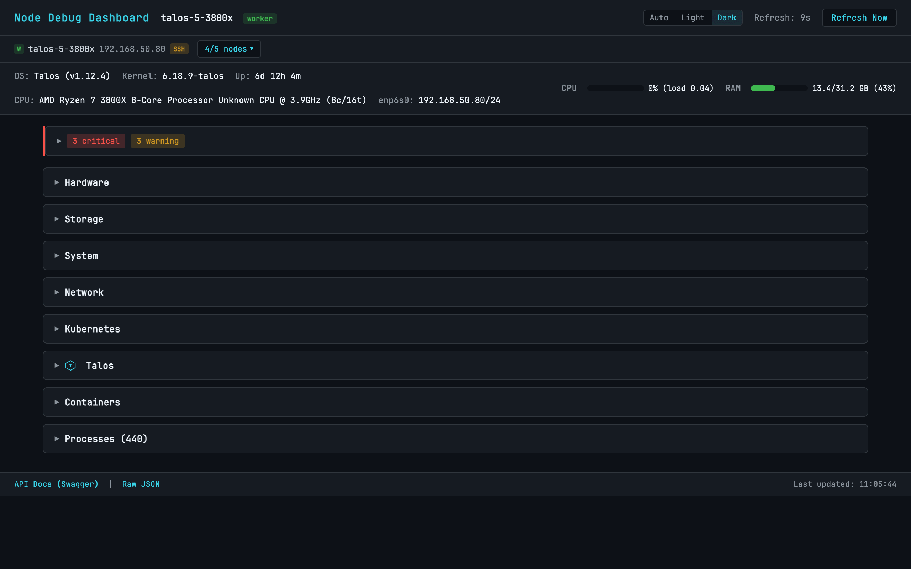

## Why this exists

[Talos Linux](https://www.talos.dev) has no shell, no package manager, and no SSH on the host. That makes it harder to look at things when a disk degrades, a NIC misbehaves, ECC errors show up, or etcd starts flapping.

This dashboard runs as a privileged DaemonSet, exposes hardware, storage, network, Kubernetes, and etcd state over an HTTP UI and REST API, and ships an opt-in SSH shell with `ndiag-*` and `kdiag-*` diagnostic scripts. The host is never modified.

It works on any Kubernetes distribution. Talos-specific bits: machine type, schematic, extensions, etcd certificates at `/system/secrets/etcd/`, EFI boot entries.

## Features

- **Hardware** — CPU, RAM (DIMMs, ECC), PCI, USB, NICs, sensors (temps/fans/voltages), NVIDIA GPUs (via nsenter)
- **Storage** — Disks, partitions, comprehensive SMART health (ATA + NVMe, wearout, temperatures, error counters, USB bridge support), disk usage with severity alerts
- **System** — UEFI boot order and entries
- **Network** — Interface stats, speed/duplex, error counters, DNS/internet/K8s API connectivity
- **Kubernetes** — Node labels, conditions, capacity/allocatable resources, PKI certificates (obfuscated), component health probes, etcd deep metrics (DB size, leader, members, raft index)
- **Talos** — Machine type (worker/CP), extensions, network interfaces, version, schematic ID
- **Containers** — System services (etcd, kubelet, apiserver...) + workload pods with memory stats
- **Live Logs** — WebSocket-based container log streaming with tail
- **Processes** — Top 200 host processes by memory with PID/PPID/user/CPU%/MEM%
- **Warnings** — Aggregated alerts from SMART, temperatures, memory errors, disk usage, certificate expiry, K8s node conditions
- **Cluster Navigation** — Searchable dropdown listing all nodes with role/status, click to jump between dashboards
- **SSH Debug Shell** — Zsh + oh-my-zsh (agnoster), vim with custom config, 11 diagnostic scripts (`ndiag-*` + `kdiag-*`) with `--raw` mode, 60+ aliases, dynamic MOTD, `help` command — [full SSH docs](docs/ssh.md)
- **Themes** — Dark, Light, and Auto (follows OS preference), persists across nodes via URL params
- **Scalable** — Tiered caching (10s/60s/5min), section-based parallel fetching, dropdown cluster bar with search
- **Auto-refresh** — 10-second polling with persistent UI state (open sections and scroll position preserved)
- **REST API** — Full Swagger/OpenAPI docs at `/docs`, per-section endpoints at `/api/sections/{name}`

## Screenshots

| Dark Theme | Light Theme |
|---|---|
| 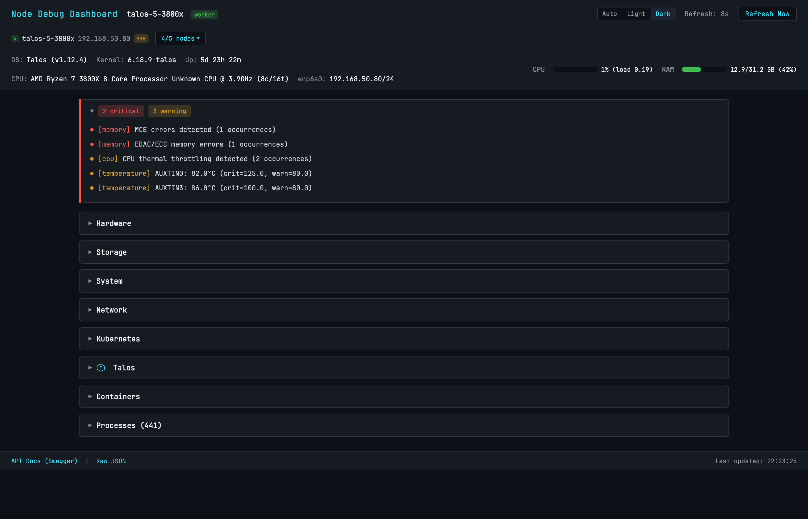 | 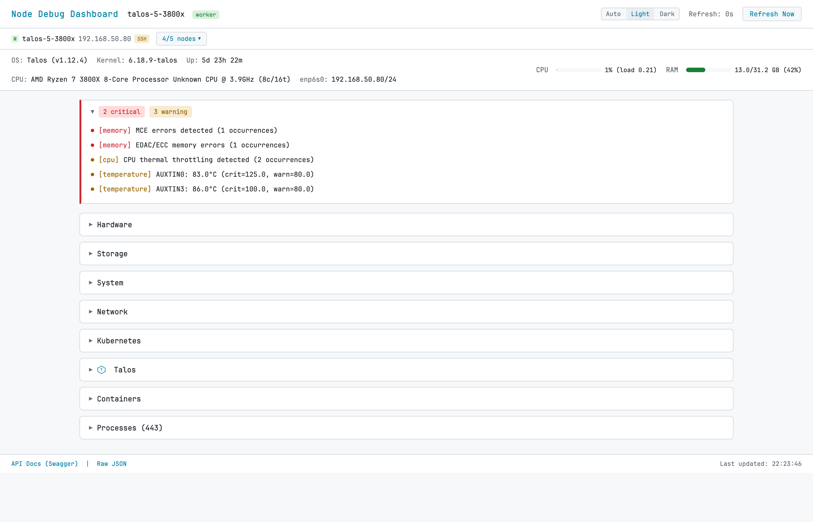 |

| Hardware + GPU (Light) | Live Log Viewer |
|---|---|
| 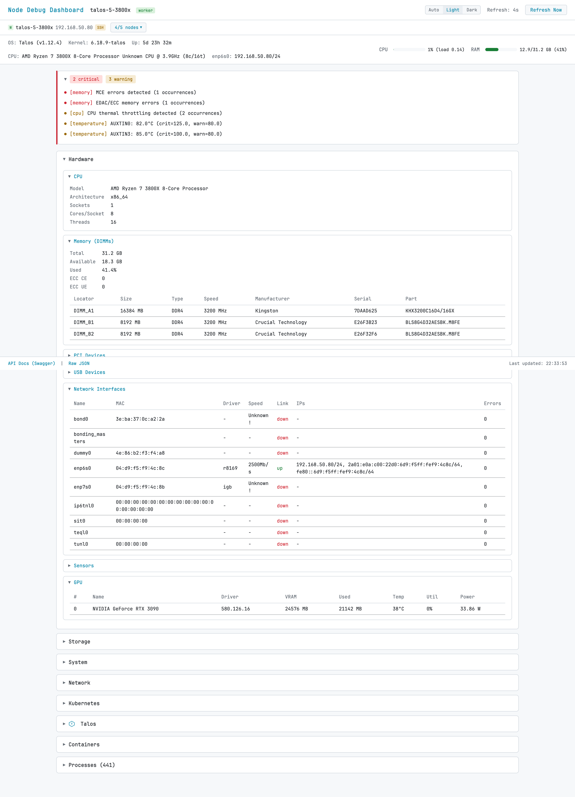 | 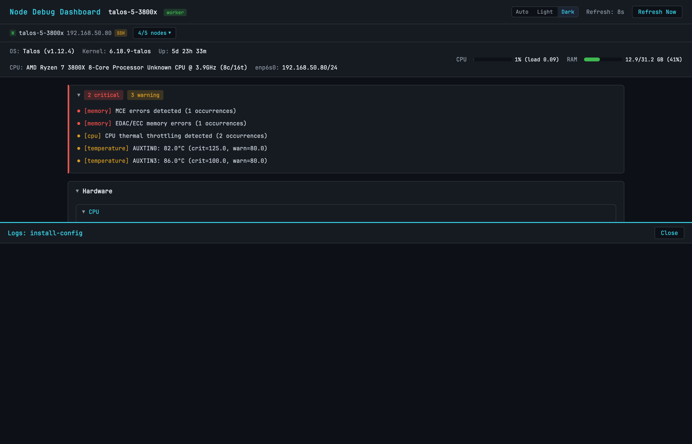 |

| K8s + etcd + Containers (CP Node) | Cluster Dropdown |
|---|---|
| 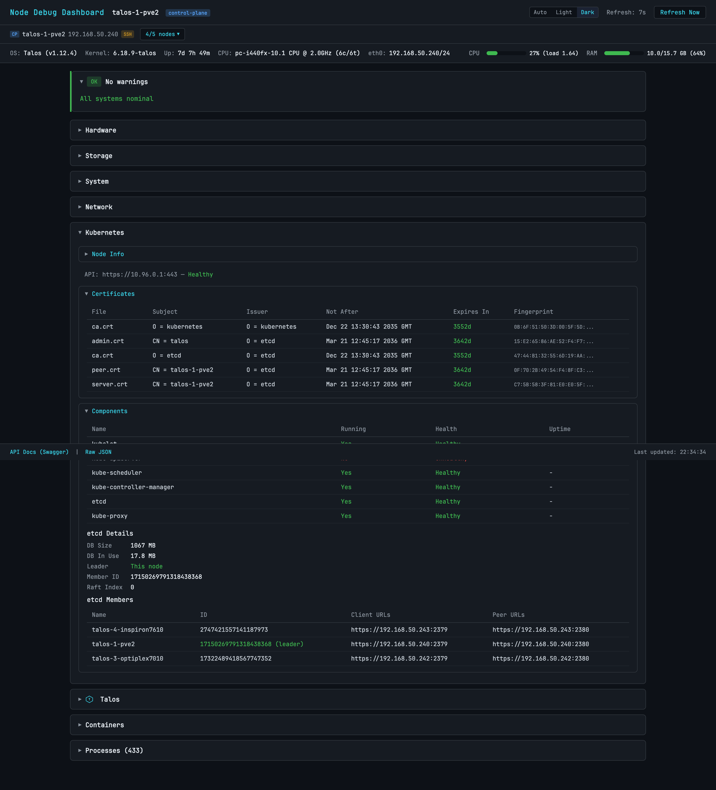 | 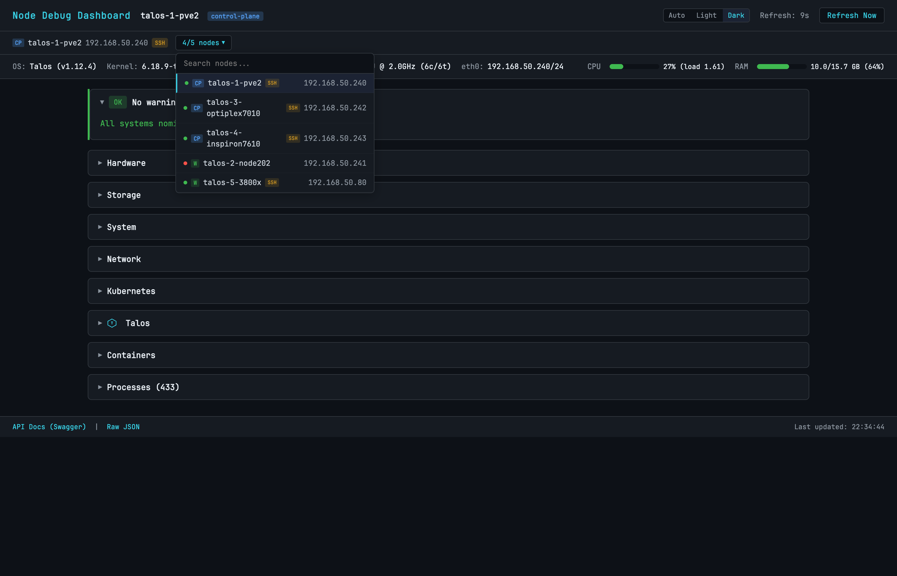 |

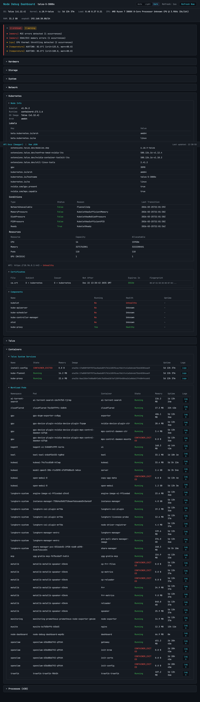

### SSH Debug Shell

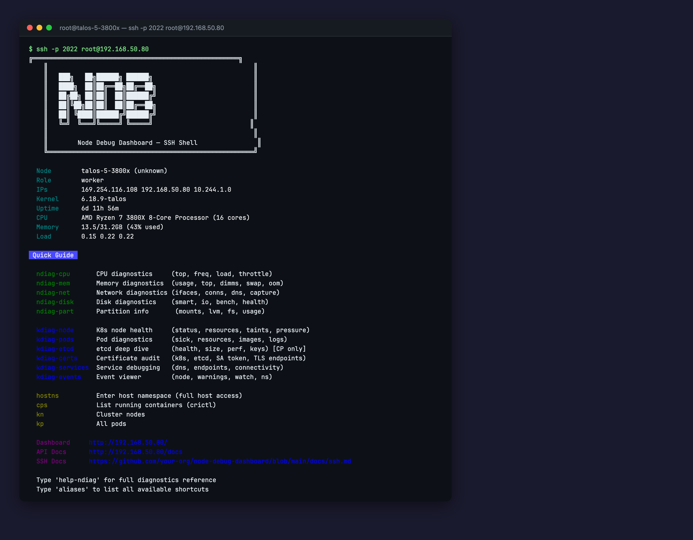

| Node Health & Resources | etcd Deep Dive (CP) |
|---|---|
| 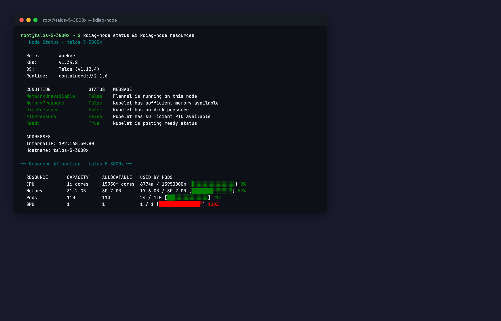 | 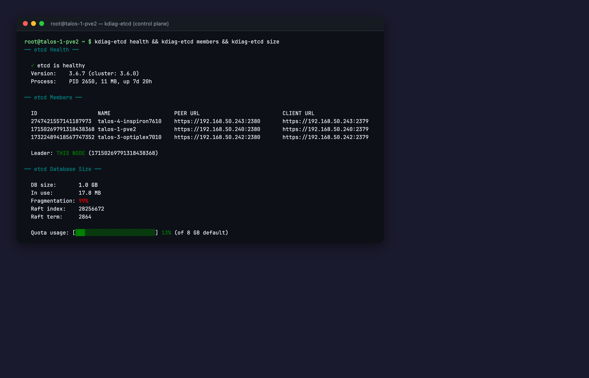 |

| Certificate Audit | Service Connectivity |
|---|---|
| 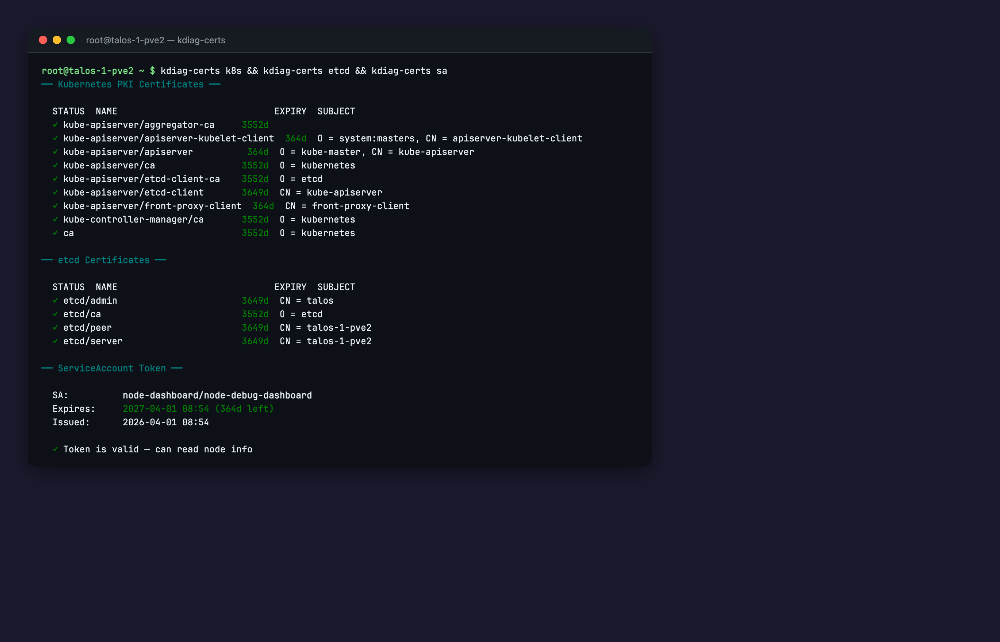 | 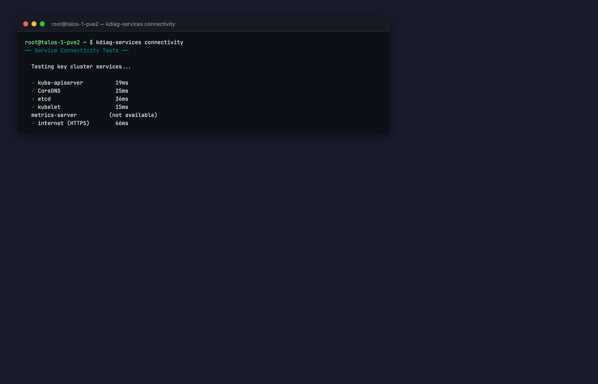 |

| Pod List | CPU & Memory Diagnostics |
|---|---|
| 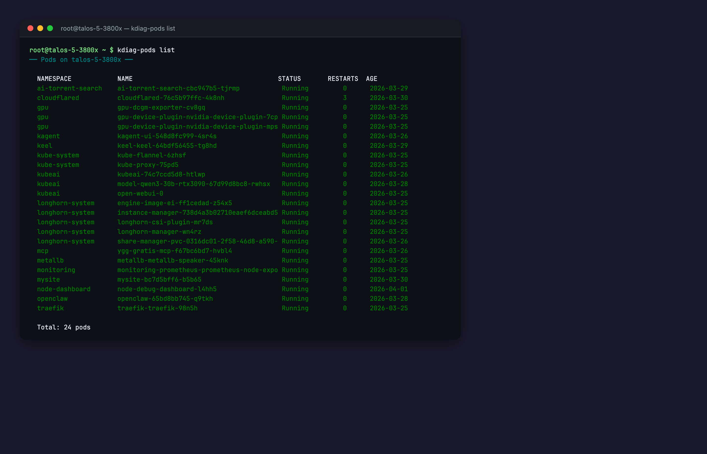 | 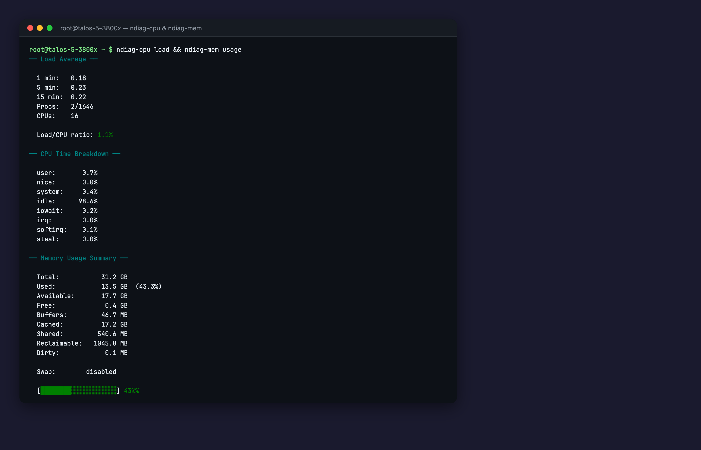 |

## Architecture

### System Overview

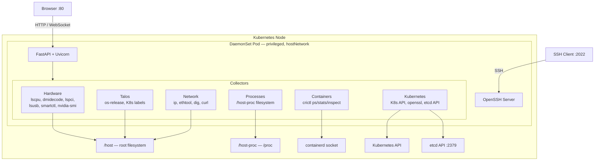
```mermaid
graph TB
    Browser["Browser :80"]
    SSH_Client["SSH Client :2022"]

    subgraph Node["Kubernetes Node"]
        subgraph Pod["DaemonSet Pod — privileged, hostNetwork"]
            direction TB
            FastAPI["FastAPI + Uvicorn"]
            SSHD["OpenSSH Server"]

            subgraph Collectors
                HW["Hardware<br/>lscpu, dmidecode, lspci,<br/>lsusb, smartctl, nvidia-smi"]
                K8S["Kubernetes<br/>K8s API, openssl, etcd API"]
                TAL["Talos<br/>os-release, K8s labels"]
                CT["Containers<br/>crictl ps/stats/inspect"]
                PROC["Processes<br/>/host-proc filesystem"]
                NET["Network<br/>ip, ethtool, dig, curl"]
            end
        end

        HostFS["/host — root filesystem"]
        HostProc["/host-proc — /proc"]
        CRI["containerd socket"]
        K8SAPI["Kubernetes API"]
        EtcdAPI["etcd API :2379"]
    end

    Browser -->|"HTTP / WebSocket"| FastAPI
    SSH_Client -->|"SSH"| SSHD
    FastAPI --> Collectors
    HW --> HostFS
    K8S --> K8SAPI
    K8S --> EtcdAPI
    TAL --> HostFS
    CT --> CRI
    PROC --> HostProc
    NET --> HostFS
```

### Data Flow

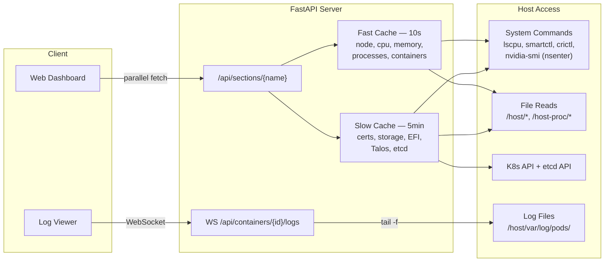
```mermaid
flowchart LR
    subgraph Client
        Dashboard["Web Dashboard"]
        LogPanel["Log Viewer"]
    end

    subgraph API["FastAPI Server"]
        Sections["/api/sections/{name}"]
        WS["WS /api/containers/{id}/logs"]
        FastCache["Fast Cache — 10s<br/>node, cpu, memory,<br/>processes, containers"]
        SlowCache["Slow Cache — 5min<br/>certs, storage, EFI,<br/>Talos, etcd"]
    end

    subgraph Host["Host Access"]
        Cmds["System Commands<br/>lscpu, smartctl, crictl,<br/>nvidia-smi (nsenter)"]
        Files["File Reads<br/>/host/*, /host-proc/*"]
        K8S["K8s API + etcd API"]
        Logs["Log Files<br/>/host/var/log/pods/"]
    end

    Dashboard -->|"parallel fetch"| Sections
    LogPanel -->|"WebSocket"| WS
    Sections --> FastCache & SlowCache
    FastCache --> Cmds & Files
    SlowCache --> Cmds & Files & K8S
    WS -->|"tail -f"| Logs
```

### Component Model

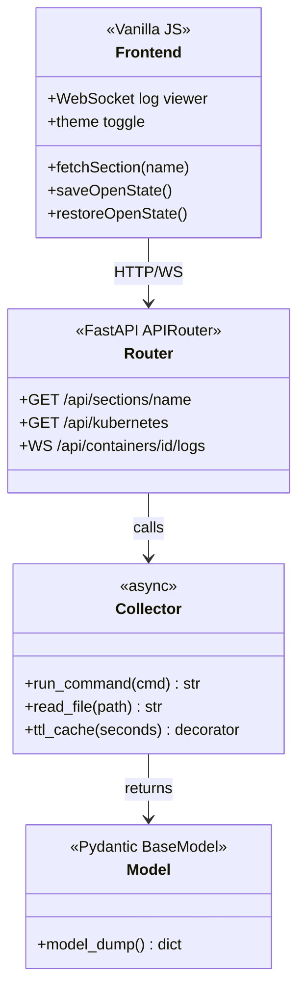
```mermaid
classDiagram
    class Collector {
        <<async>>
        +run_command(cmd) str
        +read_file(path) str
        +ttl_cache(seconds) decorator
    }

    class Model {
        <<Pydantic BaseModel>>
        +model_dump() dict
    }

    class Router {
        <<FastAPI APIRouter>>
        +GET /api/sections/name
        +GET /api/kubernetes
        +WS /api/containers/id/logs
    }

    class Frontend {
        <<Vanilla JS>>
        +fetchSection(name)
        +saveOpenState()
        +restoreOpenState()
        +WebSocket log viewer
        +theme toggle
    }

    Router --> Collector : calls
    Collector --> Model : returns
    Frontend --> Router : HTTP/WS
```

## Quick Start

### Kubernetes DaemonSet (recommended)

Deploy as a privileged DaemonSet on every node:

```yaml
apiVersion: apps/v1
kind: DaemonSet
metadata:
  name: node-debug-dashboard
spec:
  selector:
    matchLabels:
      app: node-debug-dashboard
  template:
    metadata:
      labels:
        app: node-debug-dashboard
    spec:
      hostNetwork: true
      hostPID: true
      hostIPC: true
      serviceAccountName: node-debug-dashboard
      tolerations:
        - operator: Exists
      containers:
        - name: dashboard
          image: ghcr.io/samr037/node-debug-dashboard:latest
          securityContext:
            privileged: true
          ports:
            - containerPort: 80
            - containerPort: 2022  # only used if SSH_ENABLED=true
          env:
            - name: KUBERNETES_NODE_NAME
              valueFrom:
                fieldRef:
                  fieldPath: spec.nodeName
            # SSH is disabled by default. To enable, set SSH_ENABLED=true
            # and provide your own public key in SSH_AUTHORIZED_KEYS.
            - name: SSH_ENABLED
              value: "false"
            - name: SSH_PASSWORD_AUTH
              value: "false"
            - name: SSH_AUTHORIZED_KEYS
              value: "ssh-ed25519 AAAA... user@host"
          volumeMounts:
            - name: host-root
              mountPath: /host
            - name: host-proc
              mountPath: /host-proc
              readOnly: true
      volumes:
        - name: host-root
          hostPath: { path: /, type: Directory }
        - name: host-proc
          hostPath: { path: /proc, type: Directory }
```

Then access `http://<node-ip>/` for the dashboard, `http://<node-ip>/docs` for Swagger.

> **Note:** Create a ServiceAccount with `get`/`list` permissions on `nodes`, `pods`, `services`, `endpoints`, and `events` for the Kubernetes diagnostics and SSH `kdiag-*` scripts.

### Docker (standalone)

```bash
docker run --privileged --net=host --pid=host \
  -v /:/host:ro -v /proc:/host-proc:ro \
  -e SSH_ENABLED=true \
  -p 80:80 -p 2022:2022 \
  ghcr.io/samr037/node-debug-dashboard:latest
```

## API Reference

| Endpoint | Method | Description |
|---|---|---|
| `/api/sections/{name}` | GET | Fetch a single section (node, hardware, storage, system, network, kubernetes, talos, containers, processes, warnings, cluster_nodes) |
| `/api/overview` | GET | All sections aggregated (legacy, slower) |
| `/api/node` | GET | Hostname, kernel, uptime, load, IPs |
| `/api/hardware` | GET | CPU, memory, PCI, USB, NICs, sensors, GPUs |
| `/api/hardware/cpu` | GET | CPU details |
| `/api/hardware/memory` | GET | RAM + DIMM inventory + ECC |
| `/api/hardware/pci` | GET | PCI devices |
| `/api/hardware/usb` | GET | USB devices |
| `/api/hardware/nics` | GET | Network interfaces |
| `/api/hardware/sensors` | GET | Temperature, fan, voltage readings |
| `/api/hardware/gpus` | GET | NVIDIA GPU info |
| `/api/storage` | GET | Disks, SMART, usage |
| `/api/storage/disks` | GET | Disk list with partitions |
| `/api/storage/smart` | GET | SMART health for all disks |
| `/api/storage/smart/{device}` | GET | SMART for a specific disk |
| `/api/storage/usage` | GET | Disk usage (df) |
| `/api/system/efi` | GET | UEFI boot order |
| `/api/network` | GET | Network interfaces |
| `/api/network/connectivity` | GET | DNS, internet, K8s API checks |
| `/api/kubernetes` | GET | Full K8s overview (node info, certs, components, etcd, cluster nodes, SSH info) |
| `/api/kubernetes/node-info` | GET | Node labels, conditions, resources |
| `/api/kubernetes/certificates` | GET | K8s PKI certs (obfuscated) |
| `/api/kubernetes/components` | GET | Component health probes + etcd metrics |
| `/api/talos` | GET | Full Talos overview |
| `/api/talos/config` | GET | Machine config (safe fields) |
| `/api/talos/certificates` | GET | Talos certs (obfuscated) |
| `/api/containers` | GET | System + workload containers |
| `/api/containers/system` | GET | Talos system services |
| `/api/containers/workloads` | GET | K8s workload containers |
| `/api/containers/{id}/logs` | WS | Live log stream (WebSocket) |
| `/api/processes` | GET | Top 200 processes by memory |
| `/api/warnings` | GET | Aggregated warnings |
| `/api/health` | GET | Health check for K8s probes |
| `/docs` | GET | Swagger UI |

## Configuration

| Environment Variable | Default | Description |
|---|---|---|
| `HOST_ROOT` | `/host` | Host root filesystem mount path |
| `HOST_PROC` | `/host-proc` | Host /proc mount path |
| `CACHE_TTL` | `10` | Default collector cache TTL in seconds |
| `COMMAND_TIMEOUT` | `10` | Subprocess timeout in seconds |
| `KUBERNETES_NODE_NAME` | — | Node name (set via fieldRef in K8s) |
| `SSH_ENABLED` | `false` | Enable/disable the SSH server |
| `SSH_PORT` | `2022` | SSH listen port |
| `SSH_PASSWORD_AUTH` | `false` | Enable/disable password authentication |
| `SSH_AUTHORIZED_KEYS` | — | Newline-separated public keys for SSH access |

### Security

The image contains hardcoded passwords (`debug:debug`, `root:root`) and passwordless `sudo` for the `debug` user. SSH is off by default; if you turn it on, use key-based auth.

- Keep `SSH_PASSWORD_AUTH=false` and pass keys via `SSH_AUTHORIZED_KEYS`.
- Don't expose port 2022 outside the cluster network.
- To use password auth, change the `chpasswd` calls in a derived image rather than the defaults shipped here.
- The pod runs `privileged: true` with `/` mounted at `/host`. SSH access is equivalent to root on the node.

### Caching Tiers

| TTL | Collectors |
|---|---|
| 10s | node, cpu, memory, sensors, processes, containers, network, dmesg, gpu |
| 60s | K8s node info, cluster node list |
| 300s (5min) | K8s certificates, K8s components + etcd, K8s API endpoint, storage, EFI, Talos |

## Development

```bash
# Clone
git clone <repo-url> && cd node-debug-dashboard

# Install dependencies
pip install -r requirements.txt

# Run locally (limited functionality without host mounts)
uvicorn app.main:app --host 0.0.0.0 --port 8080 --reload

# Lint
ruff check app/ && ruff format --check app/

# Build container
docker build -t node-debug-dashboard .
```

## Project Structure

```
app/
├── main.py                 # FastAPI app, router registration
├── config.py               # Environment-based configuration (host paths, SSH, cache)
├── collectors/             # Async data gathering modules
│   ├── base.py             # run_command(), read_file(), ttl_cache()
│   ├── node.py             # Hostname, kernel, uptime, load
│   ├── cpu.py              # CPU model, cores, threads
│   ├── memory.py           # RAM, DIMMs, ECC
│   ├── pci.py              # PCI devices
│   ├── usb.py              # USB devices
│   ├── network.py          # NICs, connectivity
│   ├── sensors.py          # Temps, fans, voltages via sysfs
│   ├── gpu.py              # NVIDIA GPUs via nsenter + nvidia-smi
│   ├── storage.py          # Disks, SMART, usage
│   ├── efi.py              # UEFI boot order
│   ├── dmesg.py            # Kernel log warnings
│   ├── kubernetes.py       # K8s API, certs, components, etcd, cluster nodes
│   ├── talos.py            # Machine config, certs, version
│   ├── containers.py       # crictl-based container listing + stats
│   └── processes.py        # /proc filesystem reader
├── models/                 # Pydantic response models
├── routers/                # FastAPI route handlers
│   ├── overview.py         # /api/overview aggregator (legacy)
│   ├── sections.py         # /api/sections/{name} per-section endpoint
│   ├── warnings.py         # /api/warnings aggregator
│   ├── containers.py       # REST + WebSocket log streaming
│   └── ...                 # Per-section routers
├── static/                 # Frontend (vanilla HTML/CSS/JS, no build step)
│   ├── index.html          # Dashboard layout + cluster bar + log modal
│   ├── style.css           # Dark/light/auto theme, responsive, gauges
│   └── app.js              # Section fetching, rendering, WebSocket, theme
├── entrypoint.sh           # Starts sshd (conditional) + uvicorn
└── Dockerfile              # debian:bookworm + 200 tools + crictl + Python

ssh/                        # SSH shell configuration
├── vimrc                   # Vim config (syntax, status line, K8s shortcuts)
├── zshrc                   # Zsh config (oh-my-zsh, 60+ aliases, functions)
├── motd.sh                 # Dynamic MOTD (ASCII art, node info, guide)
└── completions/            # Zsh completions for ndiag-* scripts

scripts/                    # Diagnostic scripts (in PATH via symlinks)
├── _kdiag-lib.sh           # Shared K8s API helpers, colors, formatting
├── ndiag-cpu               # CPU: top, freq, load, throttle
├── ndiag-mem               # Memory: usage, top, dimms, swap, oom
├── ndiag-net               # Network: ifaces, conns, listen, dns, reach, capture
├── ndiag-disk              # Disk: health, io, usage, bench
├── ndiag-part              # Partition: mounts, lvm, fs, table
├── kdiag-node              # K8s node: status, resources, taints, pressure, kubelet
├── kdiag-pods              # Pods: list, sick, resources, images, logs
├── kdiag-etcd              # etcd: health, members, size, alarms, perf, keys (CP)
├── kdiag-certs             # Certs: k8s, etcd, SA token, TLS endpoints
├── kdiag-services          # Services: list, dns, endpoints, connectivity
└── kdiag-events            # Events: node, warnings, all, ns, watch

docs/
├── ssh.md                  # Full SSH shell documentation
└── screenshots/            # Dashboard screenshots
```

## License

MIT
